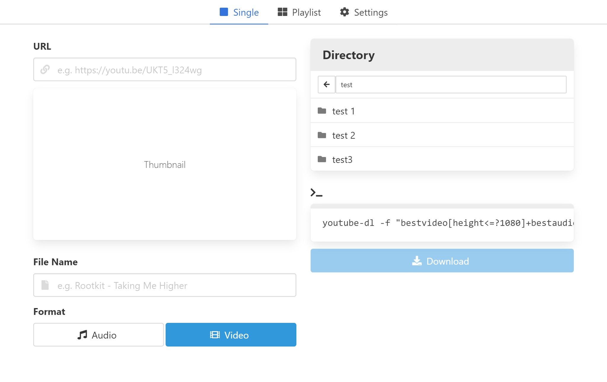

# Web app front-end for [youtube-dl][ydl] 
The goal of this app is to create a faster and easier way to interact with youtube-dl. It runs youtube-dl commands and places downloaded files at the specified directory in the container **or** sends files to the browser in the standard download bar/area (see download modes). front-dl is not responsible for playing/streaming the media itself.

## Prerequisites
- [Docker][docker]
- [Docker Compose][compose]

## Install using Compose
In order for downloads into a directory to persist, we must mount a [volume][1]. In this example, we assume our existing media library is located on the host at `/mnt/my/media`, and bind mount it into the Node.js container at `/media`, which is where the app expects it to be. 

The database mounts a volume named "mongodb" for simplicity.
```yaml
# docker-compose.yml
version: '3.2'

services:
  nodejs:
    image: m60h/front-dl:latest
    environment:
      DB_URL: mongodb://mongodb/front-dl
    volumes:
      - /mnt/my/media:/media
    ports:
      - '3001:3000'
  mongodb:
    image: mongo:4.2.3
    volumes:
      - mongodb:/data/db

volumes:
  mongodb:
```
<sup>front-dl assumes the database can be reached at `localhost`. By default, Docker Compose does not join all services to the same network namespace. Instead, they are made discoverable via their service name. So we set the database url to use `mongodb` as the host via an environment variable.</sup>

Then run `docker-compose up -d` to start the containers. The app can be accessed via host port `3001`


# Download modes
> Can be changed at any time in Settings.

### Browser mode (default)
Sends downloads to the browser in the standard download bar/area.



### Directory mode
For integration with other services to store and stream media server-side.



## Directory mode media
The root directory of the directory browser is `/media/` inside the container.

When downloading to directory, your media library (or anywhere with persistent storage) should be mounted in the container at `/media/`. All **folders** within `/media/` will then be visible in the directory browser. youtube-dl will download to the selected directory, then the file can be read and streamed by your favorite media server solution, such as Jellyfin, Emby, Plex, etc..

## Updating
To update just the `youtube-dl` binary, click the update button in Settings. Images include the latest version of youtube-dl available at the time they were built.

front-dl can be updated by pulling the latest image with `docker-compose pull` then recreating the containers with `docker-compose up -d`

## Tech
Client-side: [Mithril.js][m], [Bulma][bu], [Font Awesome][fa]

Server-side: [Docker][d], [Node.js][n], [Express.js][e], [Socket.io][socket]

Dev: [Babel][ba], [Webpack][w]

[ydl]: https://github.com/ytdl-org/youtube-dl
[m]: https://mithril.js.org/
[bu]: https://bulma.io/
[d]: https://www.docker.com/
[n]: https://nodejs.org/
[e]: https://expressjs.com/
[fa]: https://fontawesome.com/
[ba]: https://babeljs.io/
[w]: https://webpack.js.org/
[socket]: https://socket.io/
[docker]: https://docs.docker.com/install/
[compose]: https://docs.docker.com/compose/install/
[1]: https://docs.docker.com/compose/compose-file/#volumes