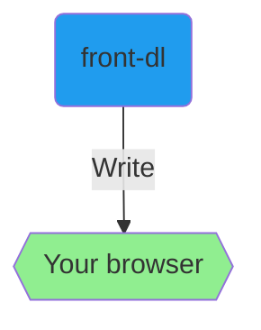
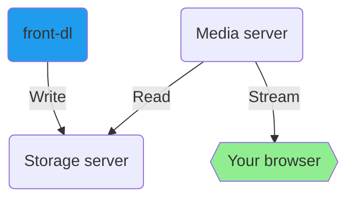

# Web app front-end for [youtube-dl][ydl] 
The goal of this app is to create a faster and easier way to interact with youtube-dl. It runs youtube-dl commands and places downloaded files at the specified directory in the container **or** sends files to the browser in the standard download bar/area (see download modes). front-dl is not responsible for playing/streaming the media itself.

## Prerequisites
- [Docker][docker]
- [Docker Compose][compose]

## Install
- Verify that the volume source path to your media library in *docker-compose.yml* is correct for your environment. This will be persistent storage when downloading to directories.
- Clone or download the repository, navigate into the directory, then run `docker-compose up -d`

Default host port to access the web app is `3001`, as specified in *docker-compose.yml*

# Download modes
> Can be changed at any time in Settings.

### Browser mode
Sends downloads to the browser in the standard download bar/area.

### Directory mode (default)
For integration with other services to store and stream media server-side.

## Directory mode media
The root directory of the directory browser is `/mnt/ydl/` inside the container.

When downloading to directory, a media library (or anywhere with persistent storage) should be mounted in the container at `/mnt/ydl/`, as shown in the *docker-compose.yml*. All **folders** within `/mnt/ydl/` will then be visible in the directory browser. youtube-dl will download to the specified directory, then the file can be read and streamed by your favorite media server solution, such as JellyFin, Emby, Plex, etc..

## Updating [youtube-dl][ydl] version
Click the update button in Settings, or rebuild the Docker image using `docker-compose build --no-cache && docker-compose up -d`

## Tech
Client-side: [Mithril.js][m], [Bulma][bu], [Font Awesome][fa]

Server-side: [Docker][d], [Node.js][n], [Express.js][e], [Socket.io][socket]

Dev: [Babel][ba], [Webpack][w]

[ydl]: https://github.com/ytdl-org/youtube-dl
[m]: https://mithril.js.org/
[bu]: https://bulma.io/
[d]: https://www.docker.com/
[n]: https://nodejs.org/
[e]: https://expressjs.com/
[fa]: https://fontawesome.com/
[ba]: https://babeljs.io/
[w]: https://webpack.js.org/
[socket]: https://socket.io/
[docker]: https://docs.docker.com/install/
[compose]: https://docs.docker.com/compose/install/