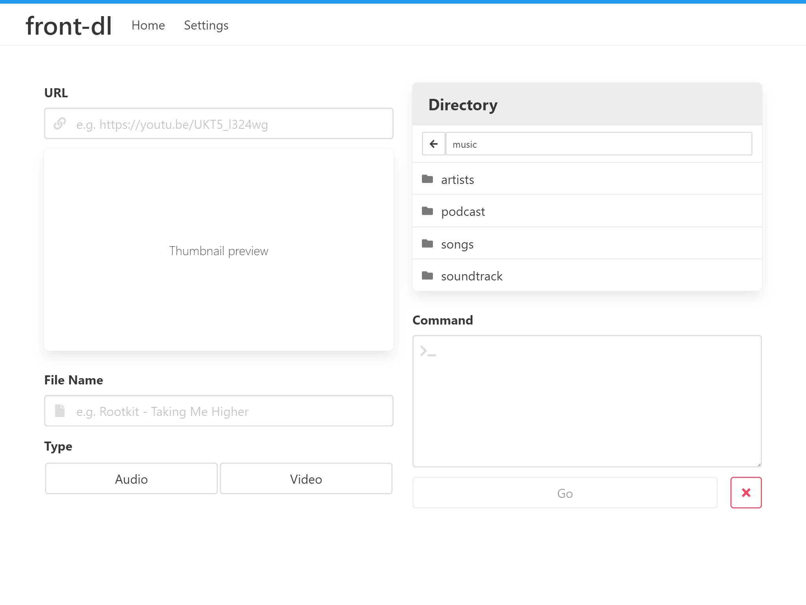

# Web app front-end for [youtube-dl][ydl] 
I wanted a faster and easier way to interact with youtube-dl, rather than what i used to do which is SSHing into a server and copy pasting commands. This app simply runs a youtube-dl command and places the downloaded file at the specified directory in the container. It doesn't download to the web browser or play any media.

## Tech
Client-side: [Mithril.js][m], [Bulma][bu], [Font Awesome][fa]

Server-side: [Docker][d], [Node.js][n], [Express.js][e]

Dev: [Babel][ba], [Webpack][w]

## Media
The intended use case is to mount a media library folder as a volume at `/mnt/ydl/` in the Docker container, as shown in the `docker-compose.yml`. All **folders** within `/mnt/ydl/` will then be visible in the directory browser. youtube-dl will download directly to the specified directory. The file can then be read and streamed by your favorite media server solution.

## Directory browser
The root directory visible in the app is based on the `path` variable in `app.js`, which is set to `/mnt/ydl/` inside the Docker container. 

[ydl]: https://github.com/ytdl-org/youtube-dl
[m]: https://mithril.js.org/
[bu]: https://bulma.io/
[d]: https://www.docker.com/
[n]: https://nodejs.org/
[e]: https://expressjs.com/
[fa]: https://fontawesome.com/
[ba]: https://babeljs.io/
[w]: https://webpack.js.org/